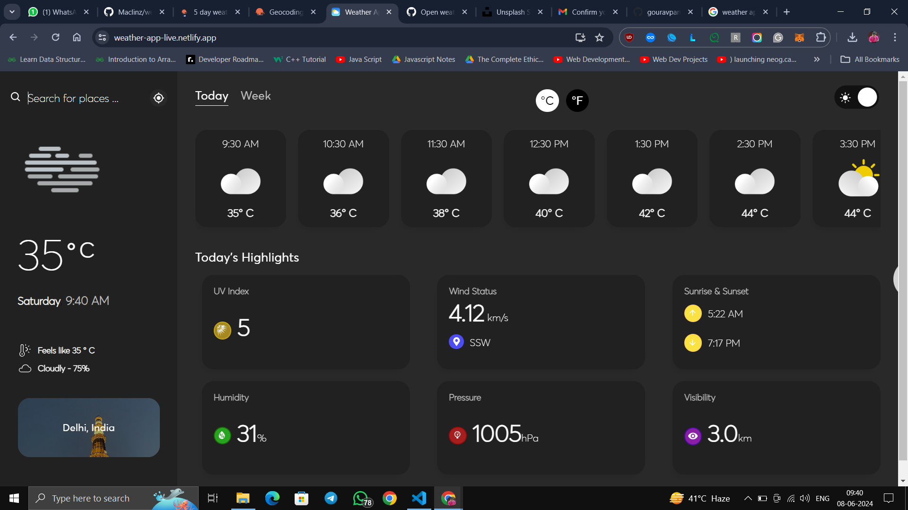
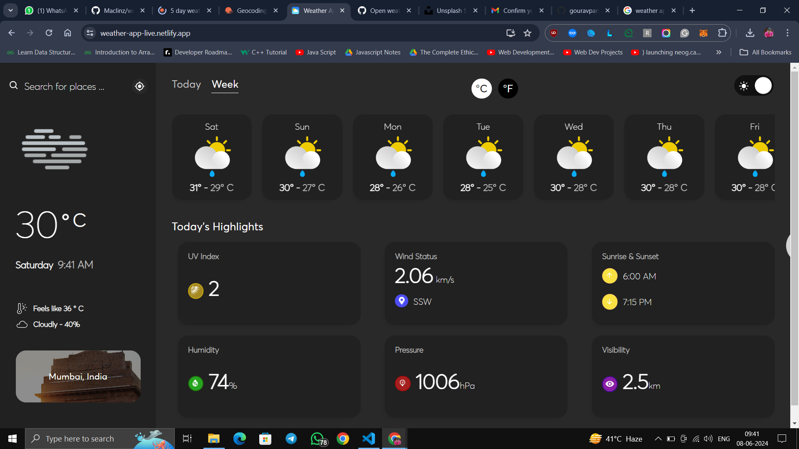
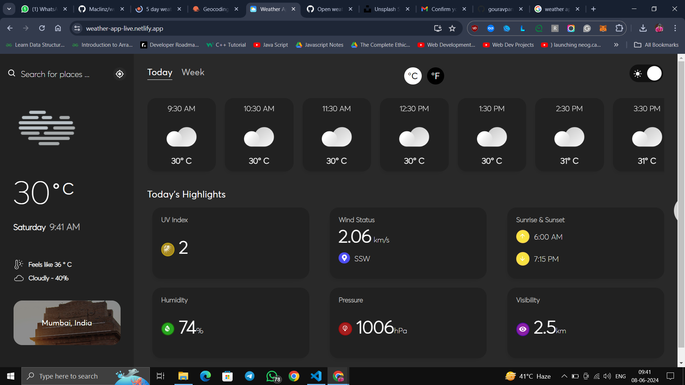
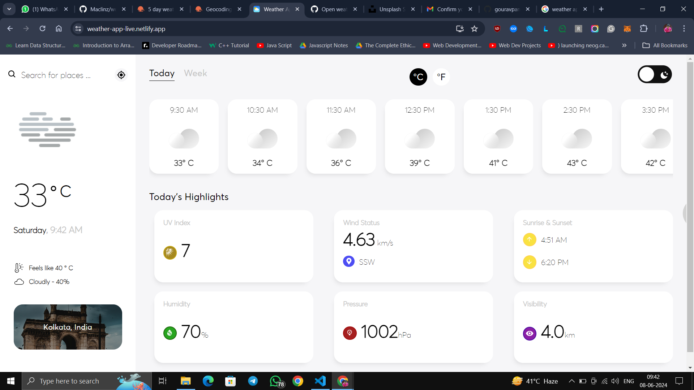
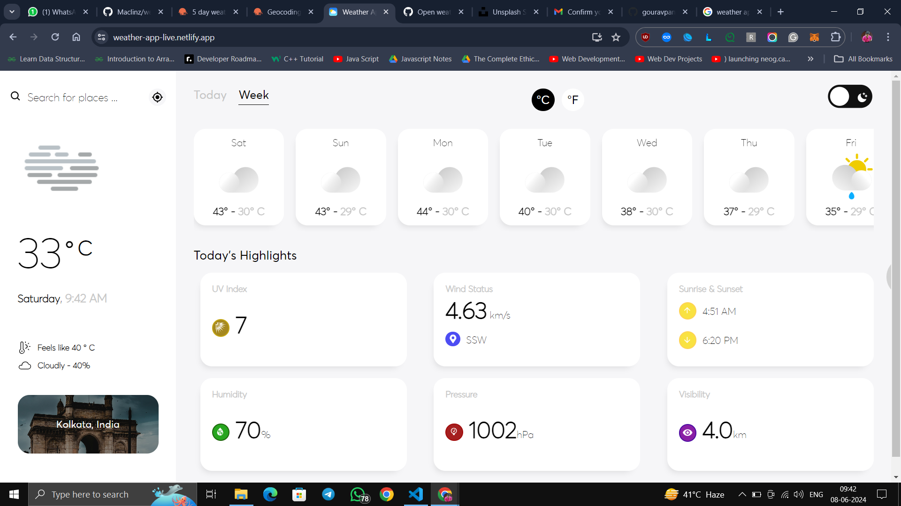
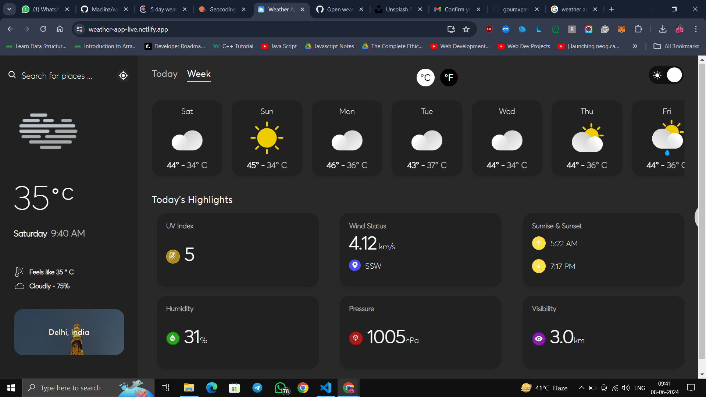

# Weather App 🌤️

## Live Demo

[Live Demo](https://weather-app-live.netlify.app/)

### Screenshots









## Get API Keys

- [OpenWeatherMap API](https://openweathermap.org/)
- [Unsplash API](https://unsplash.com/developers)

## Environment Variables

Create a `.env` file in the root of your project and add the following keys:

```plaintext
REACT_APP_API_KEY_APPID=your-api-key-for-openweathermap
REACT_APP_API_KEY_UNSPLASH=your-api-key-for-unsplash
```


## Libraries and Technologies Used

- **React**: For building the user interface
- **React Hooks**: For managing state and side effects
- **fetch**: For data fetching, included in a custom React Hook
- **Local Storage**: To save dark theme preference and current temperature conversion (Celsius or Fahrenheit)
- **Styled Components**: For styling the app
- **React Icons**: For adding icons to the app
- **React Swiper**: For creating sliders
- **Node Sass**: For using Sass in the project

## Features

- ✅ **Dark and Light Theme**: Toggle between dark and light modes.
- ✅ **City Finder**: Search for weather in different cities.
- ✅ **Geolocation API**: Get weather information based on your current location.
- ✅ **Temperature Conversion**: Convert temperatures between Celsius and Fahrenheit.
- ✅ **Beautiful UI**: Styled with Styled Components for a modern and clean look.

## Setup and Installation

1. Clone the repository:

   ```bash
   git clone https://github.com/gouravpandey009/Weather_App.git
   cd weather-app
   ```

2. Install dependencies:

   ```bash
   npm install
   ```

3. Create a `.env` file and add your API keys:

   ```plaintext
   REACT_APP_API_KEY_APPID=your-api-key-for-openweathermap
   REACT_APP_API_KEY_UNSPLASH=your-api-key-for-unsplash
   ```

4. Start the development server:
   ```bash
   npm start
   ```

## Usage

- **Search for a city**: Use the search bar to find the weather for a specific city.
- **Toggle theme**: Use the theme switcher to toggle between dark and light modes.
- **Temperature conversion**: Click on the temperature unit to switch between Celsius and Fahrenheit.

## Contributing

If you'd like to contribute to this project, please fork the repository and use a feature branch. Pull requests are warmly welcome.

---

Built with ❤️ by [Gourav Pandey](https://my-portfolio-sable-seven-64.vercel.app/)
